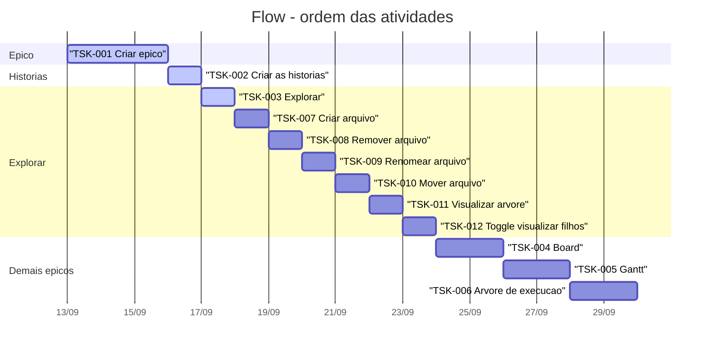

# Flow — Gantt

Ordem temporal das atividades a partir da [hierarquia de tasks](tasks/README.md).  
Datas são relativas (planejamento); ajuste conforme a execução.

## Ordem (sequência)

1. **TSK-001** Criar épico  
2. **TSK-002** Criar as histórias  
3. **TSK-003** Explorar → **TSK-007** … **TSK-012** (histórias do Explorar, em sequência)  
4. **TSK-004** Board  
5. **TSK-005** Gantt  
6. **TSK-006** Árvore de execução  

→ [`tasks/`](tasks/) · [`../board.md`](../board.md)
