# Flow — Tasks

Cada item da raia Flow no [`board.md`](../board.md) tem um **id**, uma **pasta** e um **output** em [`epics/`](../epics/README.md).

## Hierarquia

```mermaid
flowchart TD
  T001[TSK-001 Criar epico]
  T002[TSK-002 Criar as historias]
  T003[TSK-003 Explorar]
  T007[TSK-007 Criar arquivo]
  T008[TSK-008 Remover arquivo]
  T009[TSK-009 Renomear arquivo]
  T010[TSK-010 Mover arquivo]
  T011[TSK-011 Visualizar arvore]
  T028[TSK-028 Criar BDD]
  T029[TSK-029 Criar PAF]
  T030[TSK-030 Criar BDD]
  T031[TSK-031 Criar PAF]
  T032[TSK-032 Criar BDD]
  T033[TSK-033 Criar PAF]
  T034[TSK-034 Criar BDD]
  T035[TSK-035 Criar PAF]
  T036[TSK-036 Criar BDD]
  T037[TSK-037 Criar PAF]
  T004[TSK-004 Board]
  T013[TSK-013 Criar card]
  T014[TSK-014 Remover card]
  T015[TSK-015 Mover card]
  T016[TSK-016 Renomear card]
  T017[TSK-017 Abrir card]
  T018[TSK-018 Editar card]
  T019[TSK-019 Criar coluna]
  T020[TSK-020 Criar raia]
  T040[TSK-040 Criar BDD]
  T041[TSK-041 Criar PAF]
  T042[TSK-042 Criar BDD]
  T043[TSK-043 Criar PAF]
  T044[TSK-044 Criar BDD]
  T045[TSK-045 Criar PAF]
  T046[TSK-046 Criar BDD]
  T047[TSK-047 Criar PAF]
  T048[TSK-048 Criar BDD]
  T049[TSK-049 Criar PAF]
  T050[TSK-050 Criar BDD]
  T051[TSK-051 Criar PAF]
  T052[TSK-052 Criar BDD]
  T053[TSK-053 Criar PAF]
  T054[TSK-054 Criar BDD]
  T055[TSK-055 Criar PAF]
  T005[TSK-005 Gantt]
  T021[TSK-021 Criar tarefa]
  T022[TSK-022 Mover tarefa]
  T023[TSK-023 Remover tarefa]
  T024[TSK-024 Atribuir responsavel]
  T025[TSK-025 Atribuir entrada]
  T026[TSK-026 Atribuir saida]
  T027[TSK-027 Visualizar tarefas]
  T056[TSK-056 Criar BDD]
  T057[TSK-057 Criar PAF]
  T058[TSK-058 Criar BDD]
  T059[TSK-059 Criar PAF]
  T060[TSK-060 Criar BDD]
  T061[TSK-061 Criar PAF]
  T062[TSK-062 Criar BDD]
  T063[TSK-063 Criar PAF]
  T064[TSK-064 Criar BDD]
  T065[TSK-065 Criar PAF]
  T066[TSK-066 Criar BDD]
  T067[TSK-067 Criar PAF]
  T068[TSK-068 Criar BDD]
  T069[TSK-069 Criar PAF]
  T006[TSK-006 Arvore execucao]
  T001 --> T002
  T002 --> T003
  T003 --> T007
  T003 --> T008
  T003 --> T009
  T003 --> T010
  T003 --> T011
  T007 --> T028
  T007 --> T029
  T008 --> T030
  T008 --> T031
  T009 --> T032
  T009 --> T033
  T010 --> T034
  T010 --> T035
  T011 --> T036
  T011 --> T037
  T002 --> T004
  T004 --> T013
  T004 --> T014
  T004 --> T015
  T004 --> T016
  T004 --> T017
  T004 --> T018
  T004 --> T019
  T004 --> T020
  T013 --> T040
  T013 --> T041
  T014 --> T042
  T014 --> T043
  T015 --> T044
  T015 --> T045
  T016 --> T046
  T016 --> T047
  T017 --> T048
  T017 --> T049
  T018 --> T050
  T018 --> T051
  T019 --> T052
  T019 --> T053
  T020 --> T054
  T020 --> T055
  T002 --> T005
  T005 --> T021
  T005 --> T022
  T005 --> T023
  T005 --> T024
  T005 --> T025
  T005 --> T026
  T005 --> T027
  T021 --> T056
  T021 --> T057
  T022 --> T058
  T022 --> T059
  T023 --> T060
  T023 --> T061
  T024 --> T062
  T024 --> T063
  T025 --> T064
  T025 --> T065
  T026 --> T066
  T026 --> T067
  T027 --> T068
  T027 --> T069
  T002 --> T006
  style T001 fill:#fff3cd
  style T002 fill:#fff3cd
  style T003 fill:#fff3cd
  style T004 fill:#fff3cd
  style T005 fill:#fff3cd
  style T007 fill:#fff3cd
  style T008 fill:#fff3cd
  style T009 fill:#fff3cd
  style T010 fill:#fff3cd
  style T011 fill:#fff3cd
  style T013 fill:#fff3cd
  style T014 fill:#fff3cd
  style T015 fill:#fff3cd
  style T016 fill:#fff3cd
  style T017 fill:#fff3cd
  style T018 fill:#fff3cd
  style T019 fill:#fff3cd
  style T020 fill:#fff3cd
  style T021 fill:#fff3cd
  style T022 fill:#fff3cd
  style T023 fill:#fff3cd
  style T024 fill:#fff3cd
  style T025 fill:#fff3cd
  style T026 fill:#fff3cd
  style T027 fill:#fff3cd
  style T028 fill:#d4edda
  style T030 fill:#d4edda
  style T032 fill:#d4edda
  style T034 fill:#d4edda
  style T036 fill:#d4edda
  style T040 fill:#d4edda
  style T042 fill:#d4edda
  style T044 fill:#d4edda
  style T046 fill:#d4edda
  style T048 fill:#d4edda
  style T050 fill:#d4edda
  style T052 fill:#d4edda
  style T054 fill:#d4edda
  style T056 fill:#d4edda
  style T058 fill:#d4edda
  style T060 fill:#d4edda
  style T062 fill:#d4edda
  style T064 fill:#d4edda
  style T066 fill:#d4edda
  style T068 fill:#d4edda
```

| ID | Task | Status | Output |
|----|------|--------|--------|
| TSK-001 | Criar épico | Doing | [`epics/`](../epics/README.md) |
| TSK-002 | Criar as histórias | Doing | [`epics/`](../epics/README.md) |
| TSK-003 | Explorar | Doing | [EP-01](../epics/EP-01-explorar/README.md) |
| TSK-004 | Board | Doing | [EP-02](../epics/EP-02-board/README.md) |
| TSK-005 | Gantt | Doing | [EP-03](../epics/EP-03-gantt/README.md) |
| TSK-006 | Árvore de execução | Todo | [EP-04](../epics/EP-04-arvore-de-execucao/README.md) |
| TSK-007 | Criar arquivo | Doing | [US-01](../epics/EP-01-explorar/US-01-criar-arquivo/README.md) |
| TSK-028 | Criar BDD | Done | [US-01](../epics/EP-01-explorar/US-01-criar-arquivo/README.md) |
| TSK-029 | Criar PAF | Todo | [US-01](../epics/EP-01-explorar/US-01-criar-arquivo/README.md) |
| TSK-008 | Remover arquivo | Doing | [US-02](../epics/EP-01-explorar/US-02-remover-arquivo/README.md) |
| TSK-030 | Criar BDD | Done | [US-02](../epics/EP-01-explorar/US-02-remover-arquivo/README.md) |
| TSK-031 | Criar PAF | Todo | [US-02](../epics/EP-01-explorar/US-02-remover-arquivo/README.md) |
| TSK-009 | Renomear arquivo | Doing | [US-03](../epics/EP-01-explorar/US-03-renomear-arquivo/README.md) |
| TSK-032 | Criar BDD | Done | [US-03](../epics/EP-01-explorar/US-03-renomear-arquivo/README.md) |
| TSK-033 | Criar PAF | Todo | [US-03](../epics/EP-01-explorar/US-03-renomear-arquivo/README.md) |
| TSK-010 | Mover arquivo | Doing | [US-04](../epics/EP-01-explorar/US-04-mover-arquivo-dragdrop/README.md) |
| TSK-034 | Criar BDD | Done | [US-04](../epics/EP-01-explorar/US-04-mover-arquivo-dragdrop/README.md) |
| TSK-035 | Criar PAF | Todo | [US-04](../epics/EP-01-explorar/US-04-mover-arquivo-dragdrop/README.md) |
| TSK-011 | Visualizar árvore | Doing | [US-05](../epics/EP-01-explorar/US-05-visualizar-arvore-de-arquivos/README.md) |
| TSK-036 | Criar BDD | Done | [US-05](../epics/EP-01-explorar/US-05-visualizar-arvore-de-arquivos/README.md) |
| TSK-037 | Criar PAF | Todo | [US-05](../epics/EP-01-explorar/US-05-visualizar-arvore-de-arquivos/README.md) |
| TSK-013 | Criar card | Doing | [US-01](../epics/EP-02-board/US-01-criar-card/README.md) |
| TSK-040 | Criar BDD | Done | [US-01](../epics/EP-02-board/US-01-criar-card/README.md) |
| TSK-041 | Criar PAF | Todo | [US-01](../epics/EP-02-board/US-01-criar-card/README.md) |
| TSK-014 | Remover card | Doing | [US-02](../epics/EP-02-board/US-02-remover-card/README.md) |
| TSK-042 | Criar BDD | Done | [US-02](../epics/EP-02-board/US-02-remover-card/README.md) |
| TSK-043 | Criar PAF | Todo | [US-02](../epics/EP-02-board/US-02-remover-card/README.md) |
| TSK-015 | Mover card | Doing | [US-03](../epics/EP-02-board/US-03-mover-card/README.md) |
| TSK-044 | Criar BDD | Done | [US-03](../epics/EP-02-board/US-03-mover-card/README.md) |
| TSK-045 | Criar PAF | Todo | [US-03](../epics/EP-02-board/US-03-mover-card/README.md) |
| TSK-016 | Renomear card | Doing | [US-04](../epics/EP-02-board/US-04-renomear-card/README.md) |
| TSK-046 | Criar BDD | Done | [US-04](../epics/EP-02-board/US-04-renomear-card/README.md) |
| TSK-047 | Criar PAF | Todo | [US-04](../epics/EP-02-board/US-04-renomear-card/README.md) |
| TSK-017 | Abrir card | Doing | [US-05](../epics/EP-02-board/US-05-abrir-card/README.md) |
| TSK-048 | Criar BDD | Done | [US-05](../epics/EP-02-board/US-05-abrir-card/README.md) |
| TSK-049 | Criar PAF | Todo | [US-05](../epics/EP-02-board/US-05-abrir-card/README.md) |
| TSK-018 | Editar card | Doing | [US-06](../epics/EP-02-board/US-06-editar-card/README.md) |
| TSK-050 | Criar BDD | Done | [US-06](../epics/EP-02-board/US-06-editar-card/README.md) |
| TSK-051 | Criar PAF | Todo | [US-06](../epics/EP-02-board/US-06-editar-card/README.md) |
| TSK-019 | Criar coluna | Doing | [US-07](../epics/EP-02-board/US-07-criar-coluna/README.md) |
| TSK-052 | Criar BDD | Done | [US-07](../epics/EP-02-board/US-07-criar-coluna/README.md) |
| TSK-053 | Criar PAF | Todo | [US-07](../epics/EP-02-board/US-07-criar-coluna/README.md) |
| TSK-020 | Criar raia | Doing | [US-08](../epics/EP-02-board/US-08-criar-raia/README.md) |
| TSK-054 | Criar BDD | Done | [US-08](../epics/EP-02-board/US-08-criar-raia/README.md) |
| TSK-055 | Criar PAF | Todo | [US-08](../epics/EP-02-board/US-08-criar-raia/README.md) |
| TSK-021 | Criar tarefa | Doing | [US-01](../epics/EP-03-gantt/US-01-criar-tarefa/README.md) |
| TSK-056 | Criar BDD | Done | [US-01](../epics/EP-03-gantt/US-01-criar-tarefa/README.md) |
| TSK-057 | Criar PAF | Todo | [US-01](../epics/EP-03-gantt/US-01-criar-tarefa/README.md) |
| TSK-022 | Mover tarefa | Doing | [US-02](../epics/EP-03-gantt/US-02-mover-tarefa-dragdrop/README.md) |
| TSK-058 | Criar BDD | Done | [US-02](../epics/EP-03-gantt/US-02-mover-tarefa-dragdrop/README.md) |
| TSK-059 | Criar PAF | Todo | [US-02](../epics/EP-03-gantt/US-02-mover-tarefa-dragdrop/README.md) |
| TSK-023 | Remover tarefa | Doing | [US-03](../epics/EP-03-gantt/US-03-remover-tarefa/README.md) |
| TSK-060 | Criar BDD | Done | [US-03](../epics/EP-03-gantt/US-03-remover-tarefa/README.md) |
| TSK-061 | Criar PAF | Todo | [US-03](../epics/EP-03-gantt/US-03-remover-tarefa/README.md) |
| TSK-024 | Atribuir responsável | Doing | [US-04](../epics/EP-03-gantt/US-04-atribuir-responsavel/README.md) |
| TSK-062 | Criar BDD | Done | [US-04](../epics/EP-03-gantt/US-04-atribuir-responsavel/README.md) |
| TSK-063 | Criar PAF | Todo | [US-04](../epics/EP-03-gantt/US-04-atribuir-responsavel/README.md) |
| TSK-025 | Atribuir entrada | Doing | [US-05](../epics/EP-03-gantt/US-05-atribuir-entrada/README.md) |
| TSK-064 | Criar BDD | Done | [US-05](../epics/EP-03-gantt/US-05-atribuir-entrada/README.md) |
| TSK-065 | Criar PAF | Todo | [US-05](../epics/EP-03-gantt/US-05-atribuir-entrada/README.md) |
| TSK-026 | Atribuir saída | Doing | [US-06](../epics/EP-03-gantt/US-06-atribuir-saida/README.md) |
| TSK-066 | Criar BDD | Done | [US-06](../epics/EP-03-gantt/US-06-atribuir-saida/README.md) |
| TSK-067 | Criar PAF | Todo | [US-06](../epics/EP-03-gantt/US-06-atribuir-saida/README.md) |
| TSK-027 | Visualizar tarefas | Doing | [US-07](../epics/EP-03-gantt/US-07-visualizar-tarefas/README.md) |
| TSK-068 | Criar BDD | Done | [US-07](../epics/EP-03-gantt/US-07-visualizar-tarefas/README.md) |
| TSK-069 | Criar PAF | Todo | [US-07](../epics/EP-03-gantt/US-07-visualizar-tarefas/README.md) |
