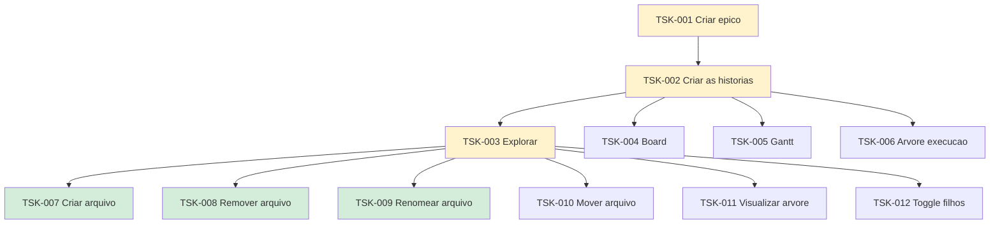

# Flow — Tasks

Cada item da raia Flow no [`board.md`](../board.md) tem um **id**, uma **pasta** e um **output** em [`epics/`](../epics/).

## Hierarquia

| ID | Task | Status | Output |
|----|------|--------|--------|
| TSK-001 | Criar épico | Doing | [`epics/`](../epics/README.md) |
| TSK-002 | Criar as histórias | Doing | [`epics/`](../epics/README.md) |
| TSK-003 | Explorar | Doing | [EP-01](../epics/EP-01-explorar/README.md) |
| TSK-004 | Board | Todo | [EP-02](../epics/EP-02-board/README.md) |
| TSK-005 | Gantt | Todo | [EP-03](../epics/EP-03-gantt/README.md) |
| TSK-006 | Árvore de execução | Todo | [EP-04](../epics/EP-04-arvore-de-execucao/README.md) |
| TSK-007 | Criar arquivo | Done | [US-01](../epics/EP-01-explorar/US-01-criar-arquivo/README.md) |
| TSK-008 | Remover arquivo | Done | [US-02](../epics/EP-01-explorar/US-02-remover-arquivo/README.md) |
| TSK-009 | Renomear arquivo | Done | [US-03](../epics/EP-01-explorar/US-03-renomear-arquivo/README.md) |
| TSK-010 | Mover arquivo | Todo | [US-04](../epics/EP-01-explorar/US-04-mover-arquivo-dragdrop/README.md) |
| TSK-011 | Visualizar árvore | Todo | [US-05](../epics/EP-01-explorar/US-05-visualizar-arvore-de-arquivos/README.md) |
| TSK-012 | Toggle filhos | Todo | [US-06](../epics/EP-01-explorar/US-06-toggle-visualizar-filhos/README.md) |
