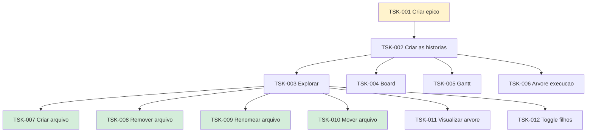

# TSK-001 — Criar épico

| Campo | Valor |
|-------|--------|
| ID | TSK-001 |
| Status | Doing |
| Pai | — |
| Board | [Flow](../../../board.md) |
| Output | [`epics/`](../../epics/README.md) |

## Árvore de atividades

## Objetivo

Criar os épicos do projeto Flow.

## Filhos

- [`TSK-002`](TSK-002-criar-as-historias/README.md) — Criar as histórias
  - [`TSK-003`](TSK-002-criar-as-historias/TSK-003-explorar/README.md) — Explorar → Output [EP-01](../../epics/EP-01-explorar/README.md)
  - [`TSK-004`](TSK-002-criar-as-historias/TSK-004-board/README.md) — Board → Output [EP-02](../../epics/EP-02-board/README.md)
  - [`TSK-005`](TSK-002-criar-as-historias/TSK-005-gantt/README.md) — Gantt → Output [EP-03](../../epics/EP-03-gantt/README.md)
  - [`TSK-006`](TSK-002-criar-as-historias/TSK-006-arvore-de-execucao/README.md) — Árvore de execução → Output [EP-04](../../epics/EP-04-arvore-de-execucao/README.md)
