# TSK-002 — Criar as histórias

| Campo | Valor |
|-------|--------|
| ID | TSK-002 |
| Status | Doing |
| Pai | [TSK-001](../README.md) |
| Board | [Flow](../../../../board.md) |
| Output | [`epics/`](../../../epics/README.md) (histórias US dentro de cada EP) |

## Árvore de atividades

```mermaid
flowchart TD
  T002[TSK-002 Criar as historias]
  T003[TSK-003 Explorar]
  T007[TSK-007 Criar arquivo]
  T008[TSK-008 Remover arquivo]
  T009[TSK-009 Renomear arquivo]
  T010[TSK-010 Mover arquivo]
  T011[TSK-011 Visualizar arvore]
  T028[TSK-028 Criar BDD]
  T029[TSK-029 Criar PAF]
  T030[TSK-030 Criar BDD]
  T031[TSK-031 Criar PAF]
  T032[TSK-032 Criar BDD]
  T033[TSK-033 Criar PAF]
  T034[TSK-034 Criar BDD]
  T035[TSK-035 Criar PAF]
  T036[TSK-036 Criar BDD]
  T037[TSK-037 Criar PAF]
  T004[TSK-004 Board]
  T013[TSK-013 Criar card]
  T014[TSK-014 Remover card]
  T015[TSK-015 Mover card]
  T016[TSK-016 Renomear card]
  T017[TSK-017 Abrir card]
  T018[TSK-018 Editar card]
  T019[TSK-019 Criar coluna]
  T020[TSK-020 Criar raia]
  T040[TSK-040 Criar BDD]
  T041[TSK-041 Criar PAF]
  T042[TSK-042 Criar BDD]
  T043[TSK-043 Criar PAF]
  T044[TSK-044 Criar BDD]
  T045[TSK-045 Criar PAF]
  T046[TSK-046 Criar BDD]
  T047[TSK-047 Criar PAF]
  T048[TSK-048 Criar BDD]
  T049[TSK-049 Criar PAF]
  T050[TSK-050 Criar BDD]
  T051[TSK-051 Criar PAF]
  T052[TSK-052 Criar BDD]
  T053[TSK-053 Criar PAF]
  T054[TSK-054 Criar BDD]
  T055[TSK-055 Criar PAF]
  T005[TSK-005 Gantt]
  T021[TSK-021 Criar tarefa]
  T022[TSK-022 Mover tarefa]
  T023[TSK-023 Remover tarefa]
  T024[TSK-024 Atribuir responsavel]
  T025[TSK-025 Atribuir entrada]
  T026[TSK-026 Atribuir saida]
  T027[TSK-027 Visualizar tarefas]
  T056[TSK-056 Criar BDD]
  T057[TSK-057 Criar PAF]
  T058[TSK-058 Criar BDD]
  T059[TSK-059 Criar PAF]
  T060[TSK-060 Criar BDD]
  T061[TSK-061 Criar PAF]
  T062[TSK-062 Criar BDD]
  T063[TSK-063 Criar PAF]
  T064[TSK-064 Criar BDD]
  T065[TSK-065 Criar PAF]
  T066[TSK-066 Criar BDD]
  T067[TSK-067 Criar PAF]
  T068[TSK-068 Criar BDD]
  T069[TSK-069 Criar PAF]
  T006[TSK-006 Arvore execucao]
  T002 --> T003
  T003 --> T007
  T003 --> T008
  T003 --> T009
  T003 --> T010
  T003 --> T011
  T007 --> T028
  T007 --> T029
  T008 --> T030
  T008 --> T031
  T009 --> T032
  T009 --> T033
  T010 --> T034
  T010 --> T035
  T011 --> T036
  T011 --> T037
  T002 --> T004
  T004 --> T013
  T004 --> T014
  T004 --> T015
  T004 --> T016
  T004 --> T017
  T004 --> T018
  T004 --> T019
  T004 --> T020
  T013 --> T040
  T013 --> T041
  T014 --> T042
  T014 --> T043
  T015 --> T044
  T015 --> T045
  T016 --> T046
  T016 --> T047
  T017 --> T048
  T017 --> T049
  T018 --> T050
  T018 --> T051
  T019 --> T052
  T019 --> T053
  T020 --> T054
  T020 --> T055
  T002 --> T005
  T005 --> T021
  T005 --> T022
  T005 --> T023
  T005 --> T024
  T005 --> T025
  T005 --> T026
  T005 --> T027
  T021 --> T056
  T021 --> T057
  T022 --> T058
  T022 --> T059
  T023 --> T060
  T023 --> T061
  T024 --> T062
  T024 --> T063
  T025 --> T064
  T025 --> T065
  T026 --> T066
  T026 --> T067
  T027 --> T068
  T027 --> T069
  T002 --> T006
  style T002 fill:#fff3cd
  style T003 fill:#d4edda
  style T004 fill:#fff3cd
  style T005 fill:#fff3cd
  style T007 fill:#d4edda
  style T008 fill:#d4edda
  style T009 fill:#d4edda
  style T010 fill:#d4edda
  style T011 fill:#d4edda
  style T013 fill:#fff3cd
  style T014 fill:#fff3cd
  style T015 fill:#fff3cd
  style T016 fill:#fff3cd
  style T017 fill:#fff3cd
  style T018 fill:#fff3cd
  style T019 fill:#fff3cd
  style T020 fill:#fff3cd
  style T021 fill:#fff3cd
  style T022 fill:#fff3cd
  style T023 fill:#fff3cd
  style T024 fill:#fff3cd
  style T025 fill:#fff3cd
  style T026 fill:#fff3cd
  style T027 fill:#fff3cd
  style T028 fill:#d4edda
  style T030 fill:#d4edda
  style T032 fill:#d4edda
  style T034 fill:#d4edda
  style T036 fill:#d4edda
  style T040 fill:#d4edda
  style T042 fill:#d4edda
  style T044 fill:#d4edda
  style T046 fill:#d4edda
  style T048 fill:#d4edda
  style T050 fill:#d4edda
  style T052 fill:#d4edda
  style T054 fill:#d4edda
  style T056 fill:#d4edda
  style T058 fill:#d4edda
  style T060 fill:#d4edda
  style T062 fill:#d4edda
  style T064 fill:#d4edda
  style T066 fill:#d4edda
  style T068 fill:#d4edda
  style T029 fill:#d4edda
  style T031 fill:#d4edda
  style T033 fill:#d4edda
  style T035 fill:#d4edda
  style T037 fill:#d4edda
```

## Objetivo

Criar as histórias de usuário do projeto Flow — output em [`epics/`](../../../epics/README.md).

## Filhos

- [`TSK-003`](TSK-003-explorar/README.md) → Output [EP-01](../../../epics/EP-01-explorar/README.md)
  - [`TSK-007`](TSK-003-explorar/TSK-007-criar-arquivo/README.md) → Output [US-01](../../../epics/EP-01-explorar/US-01-criar-arquivo/README.md)
    - [`TSK-028`](TSK-003-explorar/TSK-007-criar-arquivo/TSK-028-criar-bdd/README.md) → Criar BDD
    - [`TSK-029`](TSK-003-explorar/TSK-007-criar-arquivo/TSK-029-criar-paf/README.md) → Criar PAF
  - [`TSK-008`](TSK-003-explorar/TSK-008-remover-arquivo/README.md) → Output [US-02](../../../epics/EP-01-explorar/US-02-remover-arquivo/README.md)
    - [`TSK-030`](TSK-003-explorar/TSK-008-remover-arquivo/TSK-030-criar-bdd/README.md) → Criar BDD
    - [`TSK-031`](TSK-003-explorar/TSK-008-remover-arquivo/TSK-031-criar-paf/README.md) → Criar PAF
  - [`TSK-009`](TSK-003-explorar/TSK-009-renomear-arquivo/README.md) → Output [US-03](../../../epics/EP-01-explorar/US-03-renomear-arquivo/README.md)
    - [`TSK-032`](TSK-003-explorar/TSK-009-renomear-arquivo/TSK-032-criar-bdd/README.md) → Criar BDD
    - [`TSK-033`](TSK-003-explorar/TSK-009-renomear-arquivo/TSK-033-criar-paf/README.md) → Criar PAF
  - [`TSK-010`](TSK-003-explorar/TSK-010-mover-arquivo-dragdrop/README.md) → Output [US-04](../../../epics/EP-01-explorar/US-04-mover-arquivo-dragdrop/README.md)
    - [`TSK-034`](TSK-003-explorar/TSK-010-mover-arquivo-dragdrop/TSK-034-criar-bdd/README.md) → Criar BDD
    - [`TSK-035`](TSK-003-explorar/TSK-010-mover-arquivo-dragdrop/TSK-035-criar-paf/README.md) → Criar PAF
  - [`TSK-011`](TSK-003-explorar/TSK-011-visualizar-arvore-de-arquivos/README.md) → Output [US-05](../../../epics/EP-01-explorar/US-05-visualizar-arvore-de-arquivos/README.md)
    - [`TSK-036`](TSK-003-explorar/TSK-011-visualizar-arvore-de-arquivos/TSK-036-criar-bdd/README.md) → Criar BDD
    - [`TSK-037`](TSK-003-explorar/TSK-011-visualizar-arvore-de-arquivos/TSK-037-criar-paf/README.md) → Criar PAF
- [`TSK-004`](TSK-004-board/README.md) → Output [EP-02](../../../epics/EP-02-board/README.md)
  - [`TSK-013`](TSK-004-board/TSK-013-criar-card/README.md) → Output [US-01](../../../epics/EP-02-board/US-01-criar-card/README.md)
    - [`TSK-040`](TSK-004-board/TSK-013-criar-card/TSK-040-criar-bdd/README.md) → Criar BDD
    - [`TSK-041`](TSK-004-board/TSK-013-criar-card/TSK-041-criar-paf/README.md) → Criar PAF
  - [`TSK-014`](TSK-004-board/TSK-014-remover-card/README.md) → Output [US-02](../../../epics/EP-02-board/US-02-remover-card/README.md)
    - [`TSK-042`](TSK-004-board/TSK-014-remover-card/TSK-042-criar-bdd/README.md) → Criar BDD
    - [`TSK-043`](TSK-004-board/TSK-014-remover-card/TSK-043-criar-paf/README.md) → Criar PAF
  - [`TSK-015`](TSK-004-board/TSK-015-mover-card/README.md) → Output [US-03](../../../epics/EP-02-board/US-03-mover-card/README.md)
    - [`TSK-044`](TSK-004-board/TSK-015-mover-card/TSK-044-criar-bdd/README.md) → Criar BDD
    - [`TSK-045`](TSK-004-board/TSK-015-mover-card/TSK-045-criar-paf/README.md) → Criar PAF
  - [`TSK-016`](TSK-004-board/TSK-016-renomear-card/README.md) → Output [US-04](../../../epics/EP-02-board/US-04-renomear-card/README.md)
    - [`TSK-046`](TSK-004-board/TSK-016-renomear-card/TSK-046-criar-bdd/README.md) → Criar BDD
    - [`TSK-047`](TSK-004-board/TSK-016-renomear-card/TSK-047-criar-paf/README.md) → Criar PAF
  - [`TSK-017`](TSK-004-board/TSK-017-abrir-card/README.md) → Output [US-05](../../../epics/EP-02-board/US-05-abrir-card/README.md)
    - [`TSK-048`](TSK-004-board/TSK-017-abrir-card/TSK-048-criar-bdd/README.md) → Criar BDD
    - [`TSK-049`](TSK-004-board/TSK-017-abrir-card/TSK-049-criar-paf/README.md) → Criar PAF
  - [`TSK-018`](TSK-004-board/TSK-018-editar-card/README.md) → Output [US-06](../../../epics/EP-02-board/US-06-editar-card/README.md)
    - [`TSK-050`](TSK-004-board/TSK-018-editar-card/TSK-050-criar-bdd/README.md) → Criar BDD
    - [`TSK-051`](TSK-004-board/TSK-018-editar-card/TSK-051-criar-paf/README.md) → Criar PAF
  - [`TSK-019`](TSK-004-board/TSK-019-criar-coluna/README.md) → Output [US-07](../../../epics/EP-02-board/US-07-criar-coluna/README.md)
    - [`TSK-052`](TSK-004-board/TSK-019-criar-coluna/TSK-052-criar-bdd/README.md) → Criar BDD
    - [`TSK-053`](TSK-004-board/TSK-019-criar-coluna/TSK-053-criar-paf/README.md) → Criar PAF
  - [`TSK-020`](TSK-004-board/TSK-020-criar-raia/README.md) → Output [US-08](../../../epics/EP-02-board/US-08-criar-raia/README.md)
    - [`TSK-054`](TSK-004-board/TSK-020-criar-raia/TSK-054-criar-bdd/README.md) → Criar BDD
    - [`TSK-055`](TSK-004-board/TSK-020-criar-raia/TSK-055-criar-paf/README.md) → Criar PAF
- [`TSK-005`](TSK-005-gantt/README.md) → Output [EP-03](../../../epics/EP-03-gantt/README.md)
  - [`TSK-021`](TSK-005-gantt/TSK-021-criar-tarefa/README.md) → Output [US-01](../../../epics/EP-03-gantt/US-01-criar-tarefa/README.md)
    - [`TSK-056`](TSK-005-gantt/TSK-021-criar-tarefa/TSK-056-criar-bdd/README.md) → Criar BDD
    - [`TSK-057`](TSK-005-gantt/TSK-021-criar-tarefa/TSK-057-criar-paf/README.md) → Criar PAF
  - [`TSK-022`](TSK-005-gantt/TSK-022-mover-tarefa-dragdrop/README.md) → Output [US-02](../../../epics/EP-03-gantt/US-02-mover-tarefa-dragdrop/README.md)
    - [`TSK-058`](TSK-005-gantt/TSK-022-mover-tarefa-dragdrop/TSK-058-criar-bdd/README.md) → Criar BDD
    - [`TSK-059`](TSK-005-gantt/TSK-022-mover-tarefa-dragdrop/TSK-059-criar-paf/README.md) → Criar PAF
  - [`TSK-023`](TSK-005-gantt/TSK-023-remover-tarefa/README.md) → Output [US-03](../../../epics/EP-03-gantt/US-03-remover-tarefa/README.md)
    - [`TSK-060`](TSK-005-gantt/TSK-023-remover-tarefa/TSK-060-criar-bdd/README.md) → Criar BDD
    - [`TSK-061`](TSK-005-gantt/TSK-023-remover-tarefa/TSK-061-criar-paf/README.md) → Criar PAF
  - [`TSK-024`](TSK-005-gantt/TSK-024-atribuir-responsavel/README.md) → Output [US-04](../../../epics/EP-03-gantt/US-04-atribuir-responsavel/README.md)
    - [`TSK-062`](TSK-005-gantt/TSK-024-atribuir-responsavel/TSK-062-criar-bdd/README.md) → Criar BDD
    - [`TSK-063`](TSK-005-gantt/TSK-024-atribuir-responsavel/TSK-063-criar-paf/README.md) → Criar PAF
  - [`TSK-025`](TSK-005-gantt/TSK-025-atribuir-entrada/README.md) → Output [US-05](../../../epics/EP-03-gantt/US-05-atribuir-entrada/README.md)
    - [`TSK-064`](TSK-005-gantt/TSK-025-atribuir-entrada/TSK-064-criar-bdd/README.md) → Criar BDD
    - [`TSK-065`](TSK-005-gantt/TSK-025-atribuir-entrada/TSK-065-criar-paf/README.md) → Criar PAF
  - [`TSK-026`](TSK-005-gantt/TSK-026-atribuir-saida/README.md) → Output [US-06](../../../epics/EP-03-gantt/US-06-atribuir-saida/README.md)
    - [`TSK-066`](TSK-005-gantt/TSK-026-atribuir-saida/TSK-066-criar-bdd/README.md) → Criar BDD
    - [`TSK-067`](TSK-005-gantt/TSK-026-atribuir-saida/TSK-067-criar-paf/README.md) → Criar PAF
  - [`TSK-027`](TSK-005-gantt/TSK-027-visualizar-tarefas/README.md) → Output [US-07](../../../epics/EP-03-gantt/US-07-visualizar-tarefas/README.md)
    - [`TSK-068`](TSK-005-gantt/TSK-027-visualizar-tarefas/TSK-068-criar-bdd/README.md) → Criar BDD
    - [`TSK-069`](TSK-005-gantt/TSK-027-visualizar-tarefas/TSK-069-criar-paf/README.md) → Criar PAF
  - [`TSK-070`](TSK-005-gantt/TSK-070-selecionar-atividade/README.md) → Output [US-08](../../../epics/EP-03-gantt/US-08-selecionar-atividade/README.md)
    - [`TSK-071`](TSK-005-gantt/TSK-070-selecionar-atividade/TSK-071-criar-bdd/README.md) → Criar BDD
    - [`TSK-072`](TSK-005-gantt/TSK-070-selecionar-atividade/TSK-072-criar-paf/README.md) → Criar PAF
- [`TSK-006`](TSK-006-arvore-de-execucao/README.md) → Output [EP-04](../../../epics/EP-04-arvore-de-execucao/README.md)
