# TSK-002 — Criar as histórias

| Campo | Valor |
|-------|--------|
| ID | TSK-002 |
| Status | Doing |
| Pai | [TSK-001](../README.md) |
| Board | [Flow](../../../../board.md) |
| Output | [`epics/`](../../../epics/README.md) (histórias US dentro de cada EP) |

## Árvore de atividades

```mermaid
flowchart TD
  T002[TSK-002 Criar as historias]
  T003[TSK-003 Explorar]
  T007[TSK-007 Criar arquivo]
  T008[TSK-008 Remover arquivo]
  T009[TSK-009 Renomear arquivo]
  T010[TSK-010 Mover arquivo]
  T011[TSK-011 Visualizar arvore]
  T012[TSK-012 Expandir e recolher]
  T004[TSK-004 Board]
  T013[TSK-013 Criar card]
  T014[TSK-014 Remover card]
  T015[TSK-015 Mover card]
  T016[TSK-016 Renomear card]
  T017[TSK-017 Abrir card]
  T018[TSK-018 Editar card]
  T019[TSK-019 Criar coluna]
  T020[TSK-020 Criar raia]
  T005[TSK-005 Gantt]
  T006[TSK-006 Arvore execucao]
  T002 --> T003
  T003 --> T007
  T003 --> T008
  T003 --> T009
  T003 --> T010
  T003 --> T011
  T003 --> T012
  T002 --> T004
  T004 --> T013
  T004 --> T014
  T004 --> T015
  T004 --> T016
  T004 --> T017
  T004 --> T018
  T004 --> T019
  T004 --> T020
  T002 --> T005
  T002 --> T006
  style T002 fill:#fff3cd
  style T003 fill:#d4edda
  style T007 fill:#d4edda
  style T008 fill:#d4edda
  style T009 fill:#d4edda
  style T010 fill:#d4edda
  style T011 fill:#d4edda
  style T012 fill:#d4edda
  style T004 fill:#d4edda
  style T013 fill:#d4edda
  style T014 fill:#d4edda
  style T015 fill:#d4edda
  style T016 fill:#d4edda
  style T017 fill:#d4edda
  style T018 fill:#d4edda
  style T019 fill:#d4edda
  style T020 fill:#d4edda
```

## Objetivo

Criar as histórias de usuário do projeto Flow — output em [`epics/`](../../../epics/README.md).

## Filhos

- [`TSK-003`](TSK-003-explorar/README.md) → Output [EP-01](../../../epics/EP-01-explorar/README.md)
  - [`TSK-007`](TSK-003-explorar/TSK-007-criar-arquivo/README.md) → Output [US-01](../../../epics/EP-01-explorar/US-01-criar-arquivo/README.md)
  - [`TSK-008`](TSK-003-explorar/TSK-008-remover-arquivo/README.md) → Output [US-02](../../../epics/EP-01-explorar/US-02-remover-arquivo/README.md)
  - [`TSK-009`](TSK-003-explorar/TSK-009-renomear-arquivo/README.md) → Output [US-03](../../../epics/EP-01-explorar/US-03-renomear-arquivo/README.md)
  - [`TSK-010`](TSK-003-explorar/TSK-010-mover-arquivo-dragdrop/README.md) → Output [US-04](../../../epics/EP-01-explorar/US-04-mover-arquivo-dragdrop/README.md)
  - [`TSK-011`](TSK-003-explorar/TSK-011-visualizar-arvore-de-arquivos/README.md) → Output [US-05](../../../epics/EP-01-explorar/US-05-visualizar-arvore-de-arquivos/README.md)
  - [`TSK-012`](TSK-003-explorar/TSK-012-toggle-visualizar-filhos/README.md) → Output [US-06](../../../epics/EP-01-explorar/US-06-toggle-visualizar-filhos/README.md)
- [`TSK-004`](TSK-004-board/README.md) → Output [EP-02](../../../epics/EP-02-board/README.md)
  - [`TSK-013`](TSK-004-board/TSK-013-criar-card/README.md) → Output [US-01](../../../epics/EP-02-board/US-01-criar-card/README.md)
  - [`TSK-014`](TSK-004-board/TSK-014-remover-card/README.md) → Output [US-02](../../../epics/EP-02-board/US-02-remover-card/README.md)
  - [`TSK-015`](TSK-004-board/TSK-015-mover-card/README.md) → Output [US-03](../../../epics/EP-02-board/US-03-mover-card/README.md)
  - [`TSK-016`](TSK-004-board/TSK-016-renomear-card/README.md) → Output [US-04](../../../epics/EP-02-board/US-04-renomear-card/README.md)
  - [`TSK-017`](TSK-004-board/TSK-017-abrir-card/README.md) → Output [US-05](../../../epics/EP-02-board/US-05-abrir-card/README.md)
  - [`TSK-018`](TSK-004-board/TSK-018-editar-card/README.md) → Output [US-06](../../../epics/EP-02-board/US-06-editar-card/README.md)
  - [`TSK-019`](TSK-004-board/TSK-019-criar-coluna/README.md) → Output [US-07](../../../epics/EP-02-board/US-07-criar-coluna/README.md)
  - [`TSK-020`](TSK-004-board/TSK-020-criar-raia/README.md) → Output [US-08](../../../epics/EP-02-board/US-08-criar-raia/README.md)
- [`TSK-005`](TSK-005-gantt/README.md) → Output [EP-03](../../../epics/EP-03-gantt/README.md)
- [`TSK-006`](TSK-006-arvore-de-execucao/README.md) → Output [EP-04](../../../epics/EP-04-arvore-de-execucao/README.md)
