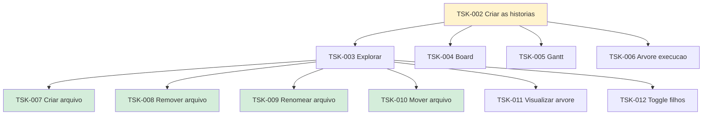

# TSK-002 — Criar as histórias

| Campo | Valor |
|-------|--------|
| ID | TSK-002 |
| Status | Doing |
| Pai | [TSK-001](../README.md) |
| Board | [Flow](../../../../board.md) |
| Output | [`epics/`](../../../epics/README.md) (histórias US dentro de cada EP) |

## Árvore de atividades

## Objetivo

Criar as histórias de usuário do projeto Flow — output em [`epics/`](../../../epics/README.md).

## Filhos

- [`TSK-003`](TSK-003-explorar/README.md) → Output [EP-01](../../../epics/EP-01-explorar/README.md)
  - [`TSK-007`](TSK-003-explorar/TSK-007-criar-arquivo/README.md) → Output [US-01](../../../epics/EP-01-explorar/US-01-criar-arquivo/README.md)
  - [`TSK-008`](TSK-003-explorar/TSK-008-remover-arquivo/README.md) → Output [US-02](../../../epics/EP-01-explorar/US-02-remover-arquivo/README.md)
  - [`TSK-009`](TSK-003-explorar/TSK-009-renomear-arquivo/README.md) → Output [US-03](../../../epics/EP-01-explorar/US-03-renomear-arquivo/README.md)
  - [`TSK-010`](TSK-003-explorar/TSK-010-mover-arquivo-dragdrop/README.md) → Output [US-04](../../../epics/EP-01-explorar/US-04-mover-arquivo-dragdrop/README.md)
  - [`TSK-011`](TSK-003-explorar/TSK-011-visualizar-arvore-de-arquivos/README.md) → Output [US-05](../../../epics/EP-01-explorar/US-05-visualizar-arvore-de-arquivos/README.md)
  - [`TSK-012`](TSK-003-explorar/TSK-012-toggle-visualizar-filhos/README.md) → Output [US-06](../../../epics/EP-01-explorar/US-06-toggle-visualizar-filhos/README.md)
- [`TSK-004`](TSK-004-board/README.md) → Output [EP-02](../../../epics/EP-02-board/README.md)
- [`TSK-005`](TSK-005-gantt/README.md) → Output [EP-03](../../../epics/EP-03-gantt/README.md)
- [`TSK-006`](TSK-006-arvore-de-execucao/README.md) → Output [EP-04](../../../epics/EP-04-arvore-de-execucao/README.md)
