# TSK-003 — Explorar

| Campo | Valor |
|-------|--------|
| ID | TSK-003 |
| Status | Doing |
| Pai | [TSK-002](../README.md) |
| Output | [EP-01 — Explorar](../../../../epics/EP-01-explorar/README.md) |

## Árvore de atividades

```mermaid
flowchart TD
  T003[TSK-003 Explorar]
  T007[TSK-007 Criar arquivo]
  T008[TSK-008 Remover arquivo]
  T009[TSK-009 Renomear arquivo]
  T010[TSK-010 Mover arquivo]
  T011[TSK-011 Visualizar arvore]
  T012[TSK-012 Expandir e recolher]
  T028[TSK-028 Criar BDD]
  T029[TSK-029 Criar PAF]
  T030[TSK-030 Criar BDD]
  T031[TSK-031 Criar PAF]
  T032[TSK-032 Criar BDD]
  T033[TSK-033 Criar PAF]
  T034[TSK-034 Criar BDD]
  T035[TSK-035 Criar PAF]
  T036[TSK-036 Criar BDD]
  T037[TSK-037 Criar PAF]
  T038[TSK-038 Criar BDD]
  T039[TSK-039 Criar PAF]
  T003 --> T007
  T003 --> T008
  T003 --> T009
  T003 --> T010
  T003 --> T011
  T003 --> T012
  T007 --> T028
  T007 --> T029
  T008 --> T030
  T008 --> T031
  T009 --> T032
  T009 --> T033
  T010 --> T034
  T010 --> T035
  T011 --> T036
  T011 --> T037
  T012 --> T038
  T012 --> T039
  style T003 fill:#fff3cd
  style T007 fill:#fff3cd
  style T028 fill:#d4edda
  style T008 fill:#fff3cd
  style T030 fill:#d4edda
  style T009 fill:#fff3cd
  style T032 fill:#d4edda
  style T010 fill:#fff3cd
  style T034 fill:#d4edda
  style T011 fill:#fff3cd
  style T036 fill:#d4edda
  style T012 fill:#fff3cd
  style T038 fill:#d4edda
```

## Filhos

- [`TSK-007`](TSK-007-criar-arquivo/README.md) → Output [US-01-criar-arquivo](../../../../epics/EP-01-explorar/US-01-criar-arquivo/README.md)
  - [`TSK-028`](TSK-007-criar-arquivo/TSK-028-criar-bdd/README.md) → Criar BDD
  - [`TSK-029`](TSK-007-criar-arquivo/TSK-029-criar-paf/README.md) → Criar PAF
- [`TSK-008`](TSK-008-remover-arquivo/README.md) → Output [US-02-remover-arquivo](../../../../epics/EP-01-explorar/US-02-remover-arquivo/README.md)
  - [`TSK-030`](TSK-008-remover-arquivo/TSK-030-criar-bdd/README.md) → Criar BDD
  - [`TSK-031`](TSK-008-remover-arquivo/TSK-031-criar-paf/README.md) → Criar PAF
- [`TSK-009`](TSK-009-renomear-arquivo/README.md) → Output [US-03-renomear-arquivo](../../../../epics/EP-01-explorar/US-03-renomear-arquivo/README.md)
  - [`TSK-032`](TSK-009-renomear-arquivo/TSK-032-criar-bdd/README.md) → Criar BDD
  - [`TSK-033`](TSK-009-renomear-arquivo/TSK-033-criar-paf/README.md) → Criar PAF
- [`TSK-010`](TSK-010-mover-arquivo-dragdrop/README.md) → Output [US-04-mover-arquivo-dragdrop](../../../../epics/EP-01-explorar/US-04-mover-arquivo-dragdrop/README.md)
  - [`TSK-034`](TSK-010-mover-arquivo-dragdrop/TSK-034-criar-bdd/README.md) → Criar BDD
  - [`TSK-035`](TSK-010-mover-arquivo-dragdrop/TSK-035-criar-paf/README.md) → Criar PAF
- [`TSK-011`](TSK-011-visualizar-arvore-de-arquivos/README.md) → Output [US-05-visualizar-arvore-de-arquivos](../../../../epics/EP-01-explorar/US-05-visualizar-arvore-de-arquivos/README.md)
  - [`TSK-036`](TSK-011-visualizar-arvore-de-arquivos/TSK-036-criar-bdd/README.md) → Criar BDD
  - [`TSK-037`](TSK-011-visualizar-arvore-de-arquivos/TSK-037-criar-paf/README.md) → Criar PAF
- [`TSK-012`](TSK-012-toggle-visualizar-filhos/README.md) → Output [US-06-toggle-visualizar-filhos](../../../../epics/EP-01-explorar/US-06-toggle-visualizar-filhos/README.md)
  - [`TSK-038`](TSK-012-toggle-visualizar-filhos/TSK-038-criar-bdd/README.md) → Criar BDD
  - [`TSK-039`](TSK-012-toggle-visualizar-filhos/TSK-039-criar-paf/README.md) → Criar PAF
