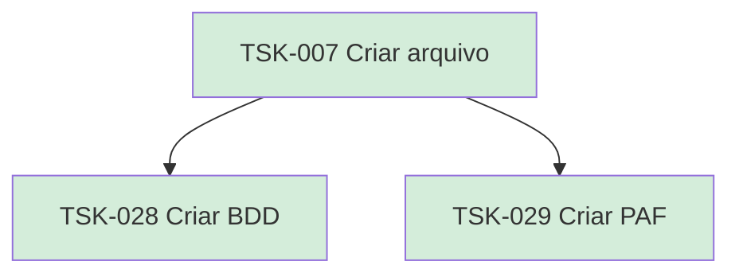

# TSK-007 — Criar arquivo

| Campo | Valor |
|-------|--------|
| ID | TSK-007 |
| Status | Done |
| Pai | [TSK-003](../README.md) |
| Output | [US-01 — Criar arquivo](../../../../../epics/EP-01-explorar/US-01-criar-arquivo/README.md) |

## Árvore de atividades

## Filhos

- [`TSK-028`](TSK-028-criar-bdd/README.md) → Criar BDD (Done)
- [`TSK-029`](TSK-029-criar-paf/README.md) → Criar PAF (Done)
