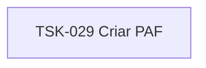

# TSK-029 — Criar PAF

| Campo | Valor |
|-------|--------|
| ID | TSK-029 |
| Status | Todo |
| Pai | [TSK-007](../README.md) |
| Output | [US-01 — Criar arquivo](../../../../../../epics/EP-01-explorar/US-01-criar-arquivo/README.md) |

## Árvore de atividades

