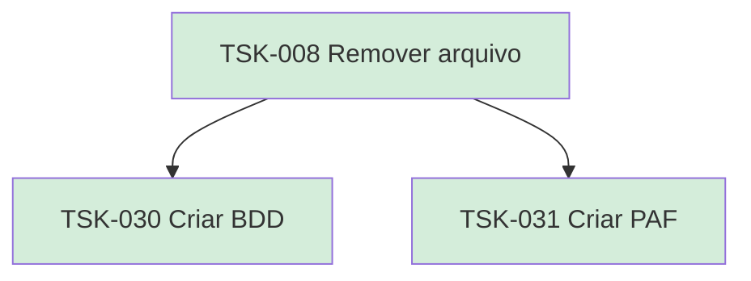

# TSK-008 — Remover arquivo

| Campo | Valor |
|-------|--------|
| ID | TSK-008 |
| Status | Done |
| Pai | [TSK-003](../README.md) |
| Output | [US-02 — Remover arquivo](../../../../../epics/EP-01-explorar/US-02-remover-arquivo/README.md) |

## Árvore de atividades

## Filhos

- [`TSK-030`](TSK-030-criar-bdd/README.md) → Criar BDD (Done)
- [`TSK-031`](TSK-031-criar-paf/README.md) → Criar PAF (Done)
