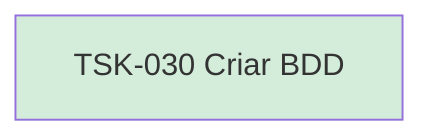

# TSK-030 — Criar BDD

| Campo | Valor |
|-------|--------|
| ID | TSK-030 |
| Status | Done |
| Pai | [TSK-008](../README.md) |
| Output | [US-02 — Remover arquivo](../../../../../../epics/EP-01-explorar/US-02-remover-arquivo/README.md) |

## Árvore de atividades

