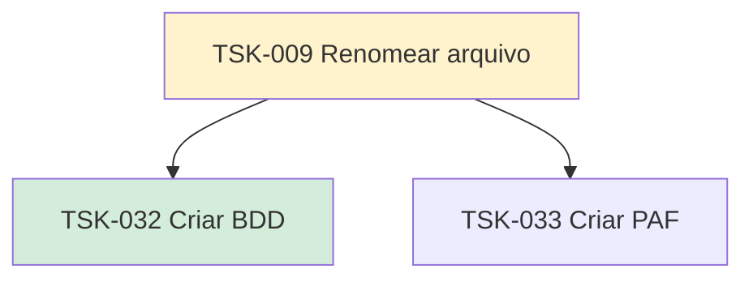

# TSK-009 — Renomear arquivo

| Campo | Valor |
|-------|--------|
| ID | TSK-009 |
| Status | Doing |
| Pai | [TSK-003](../README.md) |
| Output | [US-03 — Renomear arquivo](../../../../../epics/EP-01-explorar/US-03-renomear-arquivo/README.md) |

## Árvore de atividades

## Filhos

- [`TSK-032`](TSK-032-criar-bdd/README.md) → Criar BDD (Done)
- [`TSK-033`](TSK-033-criar-paf/README.md) → Criar PAF (Todo)
