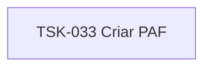

# TSK-033 — Criar PAF

| Campo | Valor |
|-------|--------|
| ID | TSK-033 |
| Status | Todo |
| Pai | [TSK-009](../README.md) |
| Output | [US-03 — Renomear arquivo](../../../../../../epics/EP-01-explorar/US-03-renomear-arquivo/README.md) |

## Árvore de atividades

