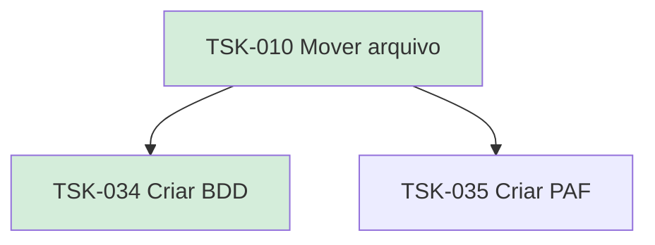

# TSK-010 — Mover arquivo

| Campo | Valor |
|-------|--------|
| ID | TSK-010 |
| Status | Done |
| Pai | [TSK-003](../README.md) |
| Output | [US-04 — Mover arquivo (drag and drop)](../../../../../epics/EP-01-explorar/US-04-mover-arquivo-dragdrop/README.md) |

## Árvore de atividades

## Filhos

- [`TSK-034`](TSK-034-criar-bdd/README.md) → Criar BDD (Done)
- [`TSK-035`](TSK-035-criar-paf/README.md) → Criar PAF (Todo)
