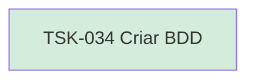

# TSK-034 — Criar BDD

| Campo | Valor |
|-------|--------|
| ID | TSK-034 |
| Status | Done |
| Pai | [TSK-010](../README.md) |
| Output | [US-04 — Mover arquivo](../../../../../../epics/EP-01-explorar/US-04-mover-arquivo-dragdrop/README.md) |

## Árvore de atividades

