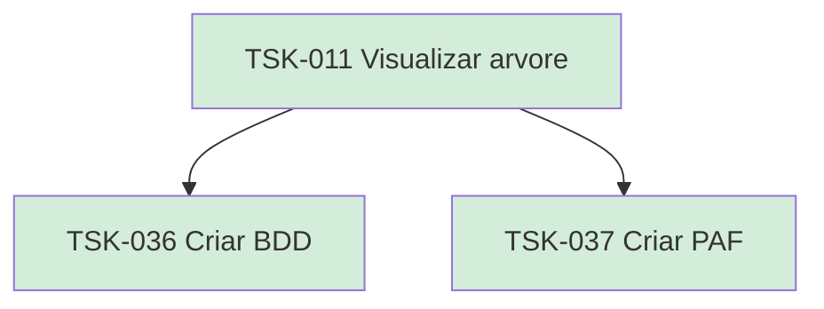

# TSK-011 — Visualizar árvore

| Campo | Valor |
|-------|--------|
| ID | TSK-011 |
| Status | Done |
| Pai | [TSK-003](../README.md) |
| Output | [US-05 — Visualizar árvore de arquivos](../../../../../epics/EP-01-explorar/US-05-visualizar-arvore-de-arquivos/README.md) |

## Árvore de atividades

## Filhos

- [`TSK-036`](TSK-036-criar-bdd/README.md) → Criar BDD (Done)
- [`TSK-037`](TSK-037-criar-paf/README.md) → Criar PAF (Done)
