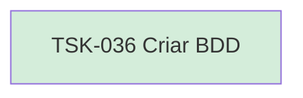

# TSK-036 — Criar BDD

| Campo | Valor |
|-------|--------|
| ID | TSK-036 |
| Status | Done |
| Pai | [TSK-011](../README.md) |
| Output | [US-05 — Visualizar arvore](../../../../../../epics/EP-01-explorar/US-05-visualizar-arvore-de-arquivos/README.md) |

## Árvore de atividades

