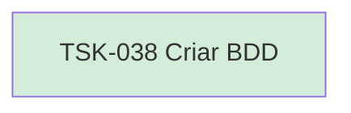

# TSK-038 — Criar BDD

| Campo | Valor |
|-------|--------|
| ID | TSK-038 |
| Status | Done |
| Pai | [TSK-012](../README.md) |
| Output | [US-06 — Expandir e recolher](../../../../../../epics/EP-01-explorar/US-06-toggle-visualizar-filhos/README.md) |

## Árvore de atividades

