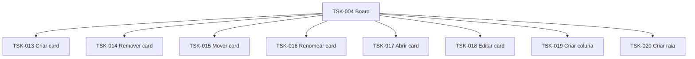

# TSK-004 — Board

| Campo | Valor |
|-------|--------|
| ID | TSK-004 |
| Status | Todo |
| Pai | [TSK-002](../README.md) |
| Output | [EP-02 — Board](../../../../epics/EP-02-board/README.md) |

## Árvore de atividades

## Filhos

- [`TSK-013`](TSK-013-criar-card/README.md) → Output [US-01](../../../../epics/EP-02-board/US-01-criar-card/README.md)
- [`TSK-014`](TSK-014-remover-card/README.md) → Output [US-02](../../../../epics/EP-02-board/US-02-remover-card/README.md)
- [`TSK-015`](TSK-015-mover-card/README.md) → Output [US-03](../../../../epics/EP-02-board/US-03-mover-card/README.md)
- [`TSK-016`](TSK-016-renomear-card/README.md) → Output [US-04](../../../../epics/EP-02-board/US-04-renomear-card/README.md)
- [`TSK-017`](TSK-017-abrir-card/README.md) → Output [US-05](../../../../epics/EP-02-board/US-05-abrir-card/README.md)
- [`TSK-018`](TSK-018-editar-card/README.md) → Output [US-06](../../../../epics/EP-02-board/US-06-editar-card/README.md)
- [`TSK-019`](TSK-019-criar-coluna/README.md) → Output [US-07](../../../../epics/EP-02-board/US-07-criar-coluna/README.md)
- [`TSK-020`](TSK-020-criar-raia/README.md) → Output [US-08](../../../../epics/EP-02-board/US-08-criar-raia/README.md)
