# TSK-004 — Board

| Campo | Valor |
|-------|--------|
| ID | TSK-004 |
| Status | Doing |
| Pai | [TSK-002](../README.md) |
| Output | [EP-02 — Board](../../../../epics/EP-02-board/README.md) |

## Árvore de atividades

```mermaid
flowchart TD
  T004[TSK-004 Board]
  T013[TSK-013 Criar card]
  T014[TSK-014 Remover card]
  T015[TSK-015 Mover card]
  T016[TSK-016 Renomear card]
  T017[TSK-017 Abrir card]
  T018[TSK-018 Editar card]
  T019[TSK-019 Criar coluna]
  T020[TSK-020 Criar raia]
  T040[TSK-040 Criar BDD]
  T041[TSK-041 Criar PAF]
  T042[TSK-042 Criar BDD]
  T043[TSK-043 Criar PAF]
  T044[TSK-044 Criar BDD]
  T045[TSK-045 Criar PAF]
  T046[TSK-046 Criar BDD]
  T047[TSK-047 Criar PAF]
  T048[TSK-048 Criar BDD]
  T049[TSK-049 Criar PAF]
  T050[TSK-050 Criar BDD]
  T051[TSK-051 Criar PAF]
  T052[TSK-052 Criar BDD]
  T053[TSK-053 Criar PAF]
  T054[TSK-054 Criar BDD]
  T055[TSK-055 Criar PAF]
  T004 --> T013
  T004 --> T014
  T004 --> T015
  T004 --> T016
  T004 --> T017
  T004 --> T018
  T004 --> T019
  T004 --> T020
  T013 --> T040
  T013 --> T041
  T014 --> T042
  T014 --> T043
  T015 --> T044
  T015 --> T045
  T016 --> T046
  T016 --> T047
  T017 --> T048
  T017 --> T049
  T018 --> T050
  T018 --> T051
  T019 --> T052
  T019 --> T053
  T020 --> T054
  T020 --> T055
  style T004 fill:#fff3cd
  style T013 fill:#fff3cd
  style T040 fill:#d4edda
  style T014 fill:#fff3cd
  style T042 fill:#d4edda
  style T015 fill:#fff3cd
  style T044 fill:#d4edda
  style T016 fill:#fff3cd
  style T046 fill:#d4edda
  style T017 fill:#fff3cd
  style T048 fill:#d4edda
  style T018 fill:#fff3cd
  style T050 fill:#d4edda
  style T019 fill:#fff3cd
  style T052 fill:#d4edda
  style T020 fill:#fff3cd
  style T054 fill:#d4edda
```

## Filhos

- [`TSK-013`](TSK-013-criar-card/README.md) → Output [US-01-criar-card](../../../../epics/EP-02-board/US-01-criar-card/README.md)
  - [`TSK-040`](TSK-013-criar-card/TSK-040-criar-bdd/README.md) → Criar BDD
  - [`TSK-041`](TSK-013-criar-card/TSK-041-criar-paf/README.md) → Criar PAF
- [`TSK-014`](TSK-014-remover-card/README.md) → Output [US-02-remover-card](../../../../epics/EP-02-board/US-02-remover-card/README.md)
  - [`TSK-042`](TSK-014-remover-card/TSK-042-criar-bdd/README.md) → Criar BDD
  - [`TSK-043`](TSK-014-remover-card/TSK-043-criar-paf/README.md) → Criar PAF
- [`TSK-015`](TSK-015-mover-card/README.md) → Output [US-03-mover-card](../../../../epics/EP-02-board/US-03-mover-card/README.md)
  - [`TSK-044`](TSK-015-mover-card/TSK-044-criar-bdd/README.md) → Criar BDD
  - [`TSK-045`](TSK-015-mover-card/TSK-045-criar-paf/README.md) → Criar PAF
- [`TSK-016`](TSK-016-renomear-card/README.md) → Output [US-04-renomear-card](../../../../epics/EP-02-board/US-04-renomear-card/README.md)
  - [`TSK-046`](TSK-016-renomear-card/TSK-046-criar-bdd/README.md) → Criar BDD
  - [`TSK-047`](TSK-016-renomear-card/TSK-047-criar-paf/README.md) → Criar PAF
- [`TSK-017`](TSK-017-abrir-card/README.md) → Output [US-05-abrir-card](../../../../epics/EP-02-board/US-05-abrir-card/README.md)
  - [`TSK-048`](TSK-017-abrir-card/TSK-048-criar-bdd/README.md) → Criar BDD
  - [`TSK-049`](TSK-017-abrir-card/TSK-049-criar-paf/README.md) → Criar PAF
- [`TSK-018`](TSK-018-editar-card/README.md) → Output [US-06-editar-card](../../../../epics/EP-02-board/US-06-editar-card/README.md)
  - [`TSK-050`](TSK-018-editar-card/TSK-050-criar-bdd/README.md) → Criar BDD
  - [`TSK-051`](TSK-018-editar-card/TSK-051-criar-paf/README.md) → Criar PAF
- [`TSK-019`](TSK-019-criar-coluna/README.md) → Output [US-07-criar-coluna](../../../../epics/EP-02-board/US-07-criar-coluna/README.md)
  - [`TSK-052`](TSK-019-criar-coluna/TSK-052-criar-bdd/README.md) → Criar BDD
  - [`TSK-053`](TSK-019-criar-coluna/TSK-053-criar-paf/README.md) → Criar PAF
- [`TSK-020`](TSK-020-criar-raia/README.md) → Output [US-08-criar-raia](../../../../epics/EP-02-board/US-08-criar-raia/README.md)
  - [`TSK-054`](TSK-020-criar-raia/TSK-054-criar-bdd/README.md) → Criar BDD
  - [`TSK-055`](TSK-020-criar-raia/TSK-055-criar-paf/README.md) → Criar PAF
