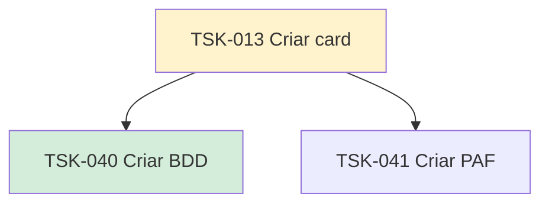

# TSK-013 — Criar card

| Campo | Valor |
|-------|--------|
| ID | TSK-013 |
| Status | Doing |
| Pai | [TSK-004](../README.md) |
| Output | [US-01 — Criar card](../../../../../epics/EP-02-board/US-01-criar-card/README.md) |

## Árvore de atividades

## Filhos

- [`TSK-040`](TSK-040-criar-bdd/README.md) → Criar BDD (Done)
- [`TSK-041`](TSK-041-criar-paf/README.md) → Criar PAF (Todo)
