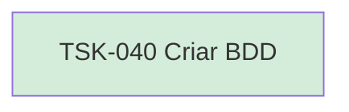

# TSK-040 — Criar BDD

| Campo | Valor |
|-------|--------|
| ID | TSK-040 |
| Status | Done |
| Pai | [TSK-013](../README.md) |
| Output | [US-01 — Criar card](../../../../../../epics/EP-02-board/US-01-criar-card/README.md) |

## Árvore de atividades

