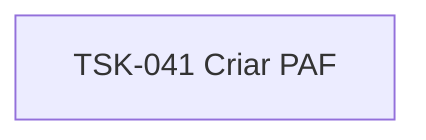

# TSK-041 — Criar PAF

| Campo | Valor |
|-------|--------|
| ID | TSK-041 |
| Status | Todo |
| Pai | [TSK-013](../README.md) |
| Output | [US-01 — Criar card](../../../../../../epics/EP-02-board/US-01-criar-card/README.md) |

## Árvore de atividades

