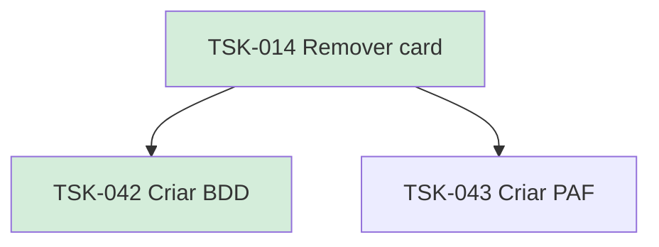

# TSK-014 — Remover card

| Campo | Valor |
|-------|--------|
| ID | TSK-014 |
| Status | Done |
| Pai | [TSK-004](../README.md) |
| Output | [US-02 — Remover card](../../../../../epics/EP-02-board/US-02-remover-card/README.md) |

## Árvore de atividades

## Filhos

- [`TSK-042`](TSK-042-criar-bdd/README.md) → Criar BDD (Done)
- [`TSK-043`](TSK-043-criar-paf/README.md) → Criar PAF (Todo)
