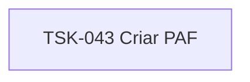

# TSK-043 — Criar PAF

| Campo | Valor |
|-------|--------|
| ID | TSK-043 |
| Status | Todo |
| Pai | [TSK-014](../README.md) |
| Output | [US-02 — Remover card](../../../../../../epics/EP-02-board/US-02-remover-card/README.md) |

## Árvore de atividades

