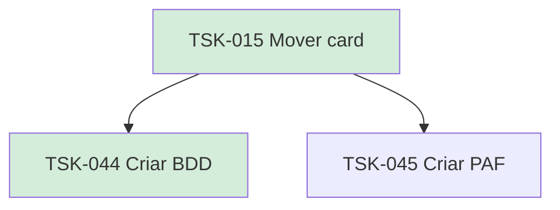

# TSK-015 — Mover card

| Campo | Valor |
|-------|--------|
| ID | TSK-015 |
| Status | Done |
| Pai | [TSK-004](../README.md) |
| Output | [US-03 — Mover card](../../../../../epics/EP-02-board/US-03-mover-card/README.md) |

## Árvore de atividades

## Filhos

- [`TSK-044`](TSK-044-criar-bdd/README.md) → Criar BDD (Done)
- [`TSK-045`](TSK-045-criar-paf/README.md) → Criar PAF (Todo)
