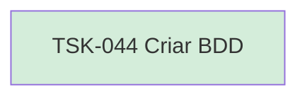

# TSK-044 — Criar BDD

| Campo | Valor |
|-------|--------|
| ID | TSK-044 |
| Status | Done |
| Pai | [TSK-015](../README.md) |
| Output | [US-03 — Mover card](../../../../../../epics/EP-02-board/US-03-mover-card/README.md) |

## Árvore de atividades

