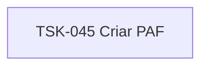

# TSK-045 — Criar PAF

| Campo | Valor |
|-------|--------|
| ID | TSK-045 |
| Status | Todo |
| Pai | [TSK-015](../README.md) |
| Output | [US-03 — Mover card](../../../../../../epics/EP-02-board/US-03-mover-card/README.md) |

## Árvore de atividades

