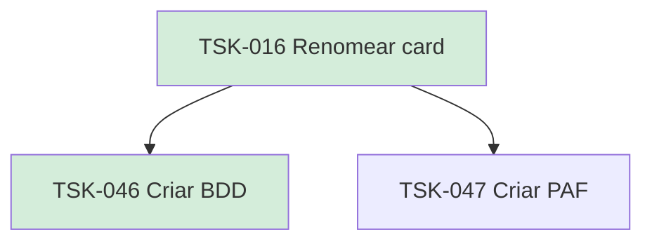

# TSK-016 — Renomear card

| Campo | Valor |
|-------|--------|
| ID | TSK-016 |
| Status | Done |
| Pai | [TSK-004](../README.md) |
| Output | [US-04 — Renomear card](../../../../../epics/EP-02-board/US-04-renomear-card/README.md) |

## Árvore de atividades

## Filhos

- [`TSK-046`](TSK-046-criar-bdd/README.md) → Criar BDD (Done)
- [`TSK-047`](TSK-047-criar-paf/README.md) → Criar PAF (Todo)
