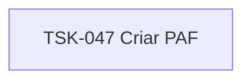

# TSK-047 — Criar PAF

| Campo | Valor |
|-------|--------|
| ID | TSK-047 |
| Status | Todo |
| Pai | [TSK-016](../README.md) |
| Output | [US-04 — Renomear card](../../../../../../epics/EP-02-board/US-04-renomear-card/README.md) |

## Árvore de atividades

