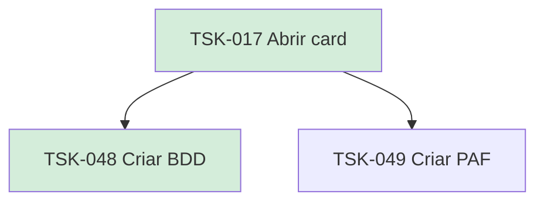

# TSK-017 — Abrir card

| Campo | Valor |
|-------|--------|
| ID | TSK-017 |
| Status | Done |
| Pai | [TSK-004](../README.md) |
| Output | [US-05 — Abrir card](../../../../../epics/EP-02-board/US-05-abrir-card/README.md) |

## Árvore de atividades

## Filhos

- [`TSK-048`](TSK-048-criar-bdd/README.md) → Criar BDD (Done)
- [`TSK-049`](TSK-049-criar-paf/README.md) → Criar PAF (Todo)
