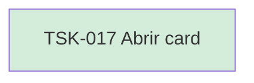

# TSK-017 — Abrir card

| Campo | Valor |
|-------|--------|
| ID | TSK-017 |
| Status | Done |
| Pai | [TSK-004](../README.md) |
| Output | [US-05 — Abrir card](../../../../epics/EP-02-board/US-05-abrir-card/README.md) |

## Árvore de atividades

