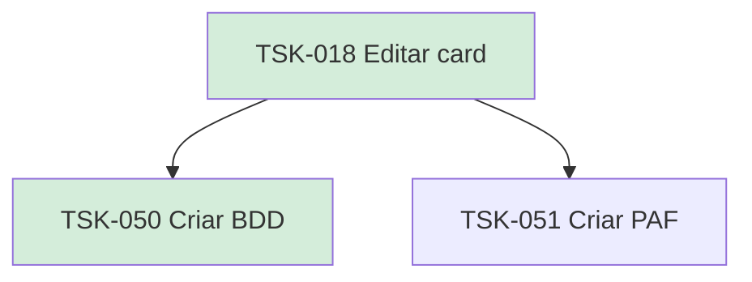

# TSK-018 — Editar card

| Campo | Valor |
|-------|--------|
| ID | TSK-018 |
| Status | Done |
| Pai | [TSK-004](../README.md) |
| Output | [US-06 — Editar card](../../../../../epics/EP-02-board/US-06-editar-card/README.md) |

## Árvore de atividades

## Filhos

- [`TSK-050`](TSK-050-criar-bdd/README.md) → Criar BDD (Done)
- [`TSK-051`](TSK-051-criar-paf/README.md) → Criar PAF (Todo)
