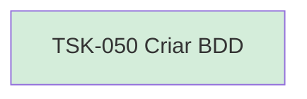

# TSK-050 — Criar BDD

| Campo | Valor |
|-------|--------|
| ID | TSK-050 |
| Status | Done |
| Pai | [TSK-018](../README.md) |
| Output | [US-06 — Editar card](../../../../../../epics/EP-02-board/US-06-editar-card/README.md) |

## Árvore de atividades

