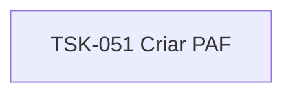

# TSK-051 — Criar PAF

| Campo | Valor |
|-------|--------|
| ID | TSK-051 |
| Status | Todo |
| Pai | [TSK-018](../README.md) |
| Output | [US-06 — Editar card](../../../../../../epics/EP-02-board/US-06-editar-card/README.md) |

## Árvore de atividades

