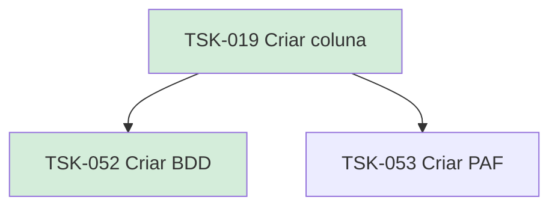

# TSK-019 — Criar coluna

| Campo | Valor |
|-------|--------|
| ID | TSK-019 |
| Status | Done |
| Pai | [TSK-004](../README.md) |
| Output | [US-07 — Criar coluna](../../../../../epics/EP-02-board/US-07-criar-coluna/README.md) |

## Árvore de atividades

## Filhos

- [`TSK-052`](TSK-052-criar-bdd/README.md) → Criar BDD (Done)
- [`TSK-053`](TSK-053-criar-paf/README.md) → Criar PAF (Todo)
