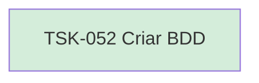

# TSK-052 — Criar BDD

| Campo | Valor |
|-------|--------|
| ID | TSK-052 |
| Status | Done |
| Pai | [TSK-019](../README.md) |
| Output | [US-07 — Criar coluna](../../../../../../epics/EP-02-board/US-07-criar-coluna/README.md) |

## Árvore de atividades

