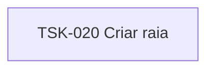

# TSK-020 — Criar raia

| Campo | Valor |
|-------|--------|
| ID | TSK-020 |
| Status | Todo |
| Pai | [TSK-004](../README.md) |
| Output | [US-08 — Criar raia](../../../../epics/EP-02-board/US-08-criar-raia/README.md) |

## Árvore de atividades

