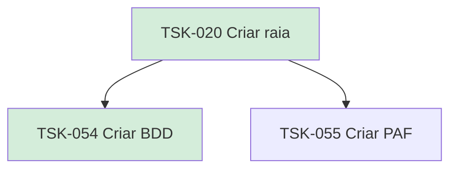

# TSK-020 — Criar raia

| Campo | Valor |
|-------|--------|
| ID | TSK-020 |
| Status | Done |
| Pai | [TSK-004](../README.md) |
| Output | [US-08 — Criar raia](../../../../../epics/EP-02-board/US-08-criar-raia/README.md) |

## Árvore de atividades

## Filhos

- [`TSK-054`](TSK-054-criar-bdd/README.md) → Criar BDD (Done)
- [`TSK-055`](TSK-055-criar-paf/README.md) → Criar PAF (Todo)
