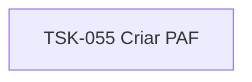

# TSK-055 — Criar PAF

| Campo | Valor |
|-------|--------|
| ID | TSK-055 |
| Status | Todo |
| Pai | [TSK-020](../README.md) |
| Output | [US-08 — Criar raia](../../../../../../epics/EP-02-board/US-08-criar-raia/README.md) |

## Árvore de atividades

