# TSK-005 — Gantt

| Campo | Valor |
|-------|--------|
| ID | TSK-005 |
| Status | Doing |
| Pai | [TSK-002](../README.md) |
| Output | [EP-03 — Gantt](../../../../epics/EP-03-gantt/README.md) |

## Árvore de atividades

```mermaid
flowchart TD
  T005[TSK-005 Gantt]
  T021[TSK-021 Criar tarefa]
  T022[TSK-022 Mover tarefa]
  T023[TSK-023 Remover tarefa]
  T024[TSK-024 Atribuir responsavel]
  T025[TSK-025 Atribuir entrada]
  T026[TSK-026 Atribuir saida]
  T027[TSK-027 Visualizar tarefas]
  T056[TSK-056 Criar BDD]
  T057[TSK-057 Criar PAF]
  T058[TSK-058 Criar BDD]
  T059[TSK-059 Criar PAF]
  T060[TSK-060 Criar BDD]
  T061[TSK-061 Criar PAF]
  T062[TSK-062 Criar BDD]
  T063[TSK-063 Criar PAF]
  T064[TSK-064 Criar BDD]
  T065[TSK-065 Criar PAF]
  T066[TSK-066 Criar BDD]
  T067[TSK-067 Criar PAF]
  T068[TSK-068 Criar BDD]
  T069[TSK-069 Criar PAF]
  T005 --> T021
  T005 --> T022
  T005 --> T023
  T005 --> T024
  T005 --> T025
  T005 --> T026
  T005 --> T027
  T021 --> T056
  T021 --> T057
  T022 --> T058
  T022 --> T059
  T023 --> T060
  T023 --> T061
  T024 --> T062
  T024 --> T063
  T025 --> T064
  T025 --> T065
  T026 --> T066
  T026 --> T067
  T027 --> T068
  T027 --> T069
  style T005 fill:#fff3cd
  style T021 fill:#fff3cd
  style T056 fill:#d4edda
  style T022 fill:#fff3cd
  style T058 fill:#d4edda
  style T023 fill:#fff3cd
  style T060 fill:#d4edda
  style T024 fill:#fff3cd
  style T062 fill:#d4edda
  style T025 fill:#fff3cd
  style T064 fill:#d4edda
  style T026 fill:#fff3cd
  style T066 fill:#d4edda
  style T027 fill:#fff3cd
  style T068 fill:#d4edda
```

## Filhos

- [`TSK-021`](TSK-021-criar-tarefa/README.md) → Output [US-01-criar-tarefa](../../../../epics/EP-03-gantt/US-01-criar-tarefa/README.md)
  - [`TSK-056`](TSK-021-criar-tarefa/TSK-056-criar-bdd/README.md) → Criar BDD
  - [`TSK-057`](TSK-021-criar-tarefa/TSK-057-criar-paf/README.md) → Criar PAF
- [`TSK-022`](TSK-022-mover-tarefa-dragdrop/README.md) → Output [US-02-mover-tarefa-dragdrop](../../../../epics/EP-03-gantt/US-02-mover-tarefa-dragdrop/README.md)
  - [`TSK-058`](TSK-022-mover-tarefa-dragdrop/TSK-058-criar-bdd/README.md) → Criar BDD
  - [`TSK-059`](TSK-022-mover-tarefa-dragdrop/TSK-059-criar-paf/README.md) → Criar PAF
- [`TSK-023`](TSK-023-remover-tarefa/README.md) → Output [US-03-remover-tarefa](../../../../epics/EP-03-gantt/US-03-remover-tarefa/README.md)
  - [`TSK-060`](TSK-023-remover-tarefa/TSK-060-criar-bdd/README.md) → Criar BDD
  - [`TSK-061`](TSK-023-remover-tarefa/TSK-061-criar-paf/README.md) → Criar PAF
- [`TSK-024`](TSK-024-atribuir-responsavel/README.md) → Output [US-04-atribuir-responsavel](../../../../epics/EP-03-gantt/US-04-atribuir-responsavel/README.md)
  - [`TSK-062`](TSK-024-atribuir-responsavel/TSK-062-criar-bdd/README.md) → Criar BDD
  - [`TSK-063`](TSK-024-atribuir-responsavel/TSK-063-criar-paf/README.md) → Criar PAF
- [`TSK-025`](TSK-025-atribuir-entrada/README.md) → Output [US-05-atribuir-entrada](../../../../epics/EP-03-gantt/US-05-atribuir-entrada/README.md)
  - [`TSK-064`](TSK-025-atribuir-entrada/TSK-064-criar-bdd/README.md) → Criar BDD
  - [`TSK-065`](TSK-025-atribuir-entrada/TSK-065-criar-paf/README.md) → Criar PAF
- [`TSK-026`](TSK-026-atribuir-saida/README.md) → Output [US-06-atribuir-saida](../../../../epics/EP-03-gantt/US-06-atribuir-saida/README.md)
  - [`TSK-066`](TSK-026-atribuir-saida/TSK-066-criar-bdd/README.md) → Criar BDD
  - [`TSK-067`](TSK-026-atribuir-saida/TSK-067-criar-paf/README.md) → Criar PAF
- [`TSK-027`](TSK-027-visualizar-tarefas/README.md) → Output [US-07-visualizar-tarefas](../../../../epics/EP-03-gantt/US-07-visualizar-tarefas/README.md)
  - [`TSK-068`](TSK-027-visualizar-tarefas/TSK-068-criar-bdd/README.md) → Criar BDD
  - [`TSK-069`](TSK-027-visualizar-tarefas/TSK-069-criar-paf/README.md) → Criar PAF
