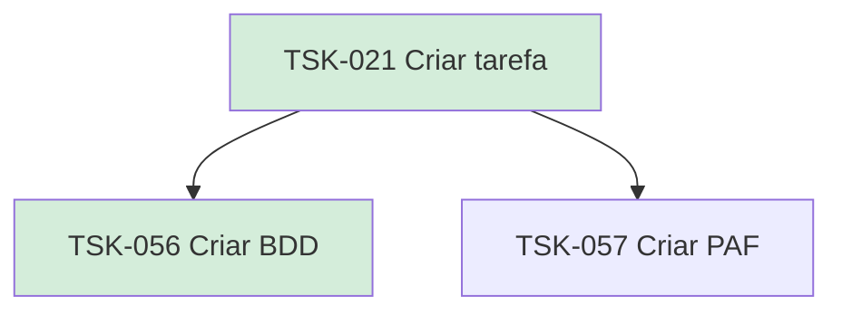

# TSK-021 — Criar tarefa

| Campo | Valor |
|-------|--------|
| ID | TSK-021 |
| Status | Done |
| Pai | [TSK-005](../README.md) |
| Output | [US-01 — Criar tarefa](../../../../../epics/EP-03-gantt/US-01-criar-tarefa/README.md) |

## Árvore de atividades

## Filhos

- [`TSK-056`](TSK-056-criar-bdd/README.md) → Criar BDD (Done)
- [`TSK-057`](TSK-057-criar-paf/README.md) → Criar PAF (Todo)
