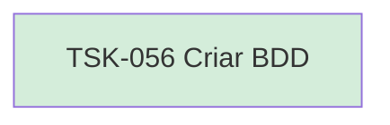

# TSK-056 — Criar BDD

| Campo | Valor |
|-------|--------|
| ID | TSK-056 |
| Status | Done |
| Pai | [TSK-021](../README.md) |
| Output | [US-01 — Criar tarefa](../../../../../../epics/EP-03-gantt/US-01-criar-tarefa/README.md) |

## Árvore de atividades

