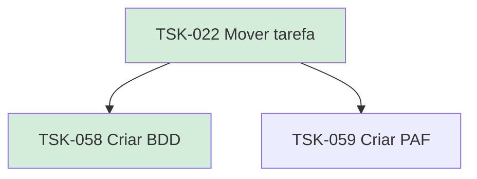

# TSK-022 — Mover tarefa

| Campo | Valor |
|-------|--------|
| ID | TSK-022 |
| Status | Done |
| Pai | [TSK-005](../README.md) |
| Output | [US-02 — Mover tarefa (drag and drop)](../../../../../epics/EP-03-gantt/US-02-mover-tarefa-dragdrop/README.md) |

## Árvore de atividades

## Filhos

- [`TSK-058`](TSK-058-criar-bdd/README.md) → Criar BDD (Done)
- [`TSK-059`](TSK-059-criar-paf/README.md) → Criar PAF (Todo)
