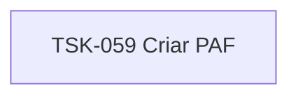

# TSK-059 — Criar PAF

| Campo | Valor |
|-------|--------|
| ID | TSK-059 |
| Status | Todo |
| Pai | [TSK-022](../README.md) |
| Output | [US-02 — Mover tarefa](../../../../../../epics/EP-03-gantt/US-02-mover-tarefa-dragdrop/README.md) |

## Árvore de atividades

