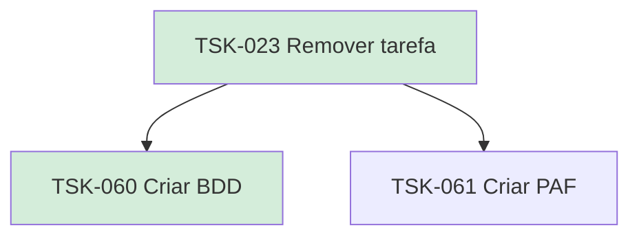

# TSK-023 — Remover tarefa

| Campo | Valor |
|-------|--------|
| ID | TSK-023 |
| Status | Done |
| Pai | [TSK-005](../README.md) |
| Output | [US-03 — Remover tarefa](../../../../../epics/EP-03-gantt/US-03-remover-tarefa/README.md) |

## Árvore de atividades

## Filhos

- [`TSK-060`](TSK-060-criar-bdd/README.md) → Criar BDD (Done)
- [`TSK-061`](TSK-061-criar-paf/README.md) → Criar PAF (Todo)
