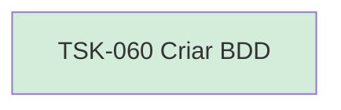

# TSK-060 — Criar BDD

| Campo | Valor |
|-------|--------|
| ID | TSK-060 |
| Status | Done |
| Pai | [TSK-023](../README.md) |
| Output | [US-03 — Remover tarefa](../../../../../../epics/EP-03-gantt/US-03-remover-tarefa/README.md) |

## Árvore de atividades

