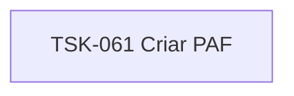

# TSK-061 — Criar PAF

| Campo | Valor |
|-------|--------|
| ID | TSK-061 |
| Status | Todo |
| Pai | [TSK-023](../README.md) |
| Output | [US-03 — Remover tarefa](../../../../../../epics/EP-03-gantt/US-03-remover-tarefa/README.md) |

## Árvore de atividades

