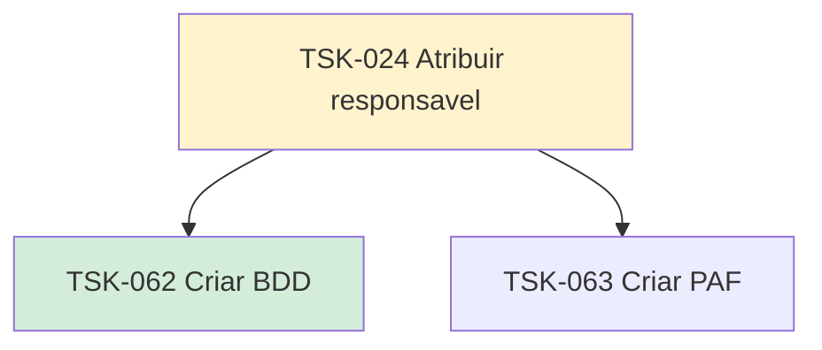

# TSK-024 — Atribuir responsável

| Campo | Valor |
|-------|--------|
| ID | TSK-024 |
| Status | Doing |
| Pai | [TSK-005](../README.md) |
| Output | [US-04 — Atribuir responsável](../../../../../epics/EP-03-gantt/US-04-atribuir-responsavel/README.md) |

## Árvore de atividades

## Filhos

- [`TSK-062`](TSK-062-criar-bdd/README.md) → Criar BDD (Done)
- [`TSK-063`](TSK-063-criar-paf/README.md) → Criar PAF (Todo)
